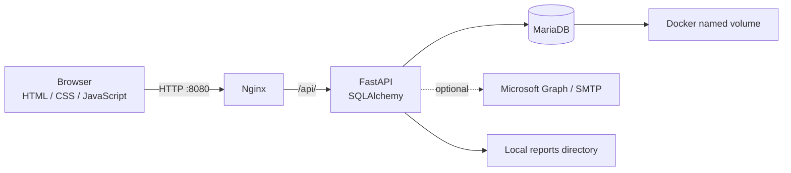

# RoomBook — 会議室予約システム

**会議室の空き状況確認・予約・承認・利用状況の集計を行う業務 Web アプリケーション。**

FastAPI・SQLAlchemy・MariaDB と HTML・CSS・JavaScript で構成し、Docker Compose で Web・API・DB を分離しています。AI 支援を活用した開発事例として、機能と構成を説明するポートフォリオです。

> この公開版は架空データで確認できるポートフォリオです。実在する従業員の情報・予約履歴・認証情報・社内接続先を含めず、名称とロゴもデモ用に置き換えています。

[中文操作說明](docs/SETUP.zh-TW.md) · [設計とコードの読みどころ](docs/ARCHITECTURE.md)

## ブラウザで試す

**[ログイン不要の公開プレビューを開く](https://bai15568773257-source.github.io/roombook-portfolio/)**

一般ユーザーの画面として、ダッシュボード・会議室の空き状況・タイムライン・カレンダーをご覧いただけます。管理者アカウントやパスワードは不要です。人物・予約はすべて架空のサンプルで、予約の保存・変更・削除・メール送信は行えません。

公開プレビューは GitHub Pages 上の静的ページです。データはブラウザ内で生成し、業務 API・データベースへは接続しません。公開版の生成方法は [デモの説明](demo/README.md) を参照してください。

## 解決する課題

会議室の空き時間を確認し、時間の重複を避けて予約し、必要な予約を管理者が承認する流れを一つの画面群にまとめます。予約状況は一覧・時間軸・カレンダーで確認でき、利用状況を CSV で出力できます。


## 主な機能

| 利用者向け | 管理者向け |
| --- | --- |
| 会議室と空き時間の確認 | 予約の承認・却下・管理 |
| 通常予約・週次の繰り返し予約 | ユーザー管理 |
| タイムライン・カレンダー | 監査ログの確認 |
| プロフィール・パスワード管理 | 利用状況レポートの CSV 出力 |
| 日本語・中国語・英語の表示 | メッセージ・メール通知の設定 |

Microsoft Graph / SMTP による通知・リマインダーは任意設定です。メール未設定のデモ環境では、パスワード再設定メールなどは送信できません。

## システム構成



| レイヤー | 技術 |
| --- | --- |
| フロントエンド | HTML / CSS / JavaScript、多言語表示、テーマ切替 |
| バックエンド | Python 3.12 / FastAPI / SQLAlchemy |
| データベース | MariaDB 11.4 / PyMySQL |
| 認証 | JWT Cookie / bcrypt |
| 配信・実行 | Nginx / Docker Compose |

## 設計上のポイント

1. **画面と API と DB の分離** — Nginx が画面を配信し、同一オリジンの `/api/` を API に転送します。
2. **サーバー側での予約ルール検証** — 営業時間・利用時間・承認条件を API で検証します。
3. **重複予約への対応** — 予約登録時に会議室の行ロックと時間重複チェックを行います。詳細は [設計メモ](docs/ARCHITECTURE.md) を参照してください。
4. **管理権限と操作履歴** — 管理者用 API の権限確認と監査ログを備えています。

## ローカルでの実行

### UI を見る

`demo/server.py` は架空の一般ユーザーとして開く、ローカル専用・読み取り専用の画面プレビューです。MariaDB やメールサービスには接続しません。

```sh
python3 demo/server.py
```

`http://127.0.0.1:8765` を開きます。画面上に DEMO 表示があり、作成・変更・削除はできません。これは画面確認用であり、実際の認証・予約処理の動作検証ではありません。

### API / DB を含めて動かす

Docker と Docker Compose が必要です。新しい独立環境で、`.env.example` を `.env` にコピーしてください。

```sh
cp .env.example .env
python3 -c 'import secrets; print("\n".join(secrets.token_hex(32) for _ in range(4)))'
```

生成した別々の値を `DB_PASSWORD`、`MARIADB_ROOT_PASSWORD`、`JWT_SECRET`、`ADMIN_PASSWORD` に設定します。メールや外部サービスの認証情報は任意設定です。

```sh
docker compose -p roombook-demo up -d --build
```

`http://localhost:8080` を開き、`.env` で設定した管理者アカウントでログインします。空の DB からテーブル・デモ会議室・管理者が初期化されるため、実データのインポートは不要です。

HTTPS で動かす場合は `COOKIE_SECURE=true` と適切な `APP_BASE_URL` を設定してください。詳細は [中文セットアップガイド](docs/SETUP.zh-TW.md) に記載しています。

## 確認状況と今後の改善

- Python と JavaScript の構文、Compose の構造、個人情報・認証情報の混入を確認。
- UI デモのダッシュボード・タイムライン・カレンダーをブラウザで表示確認。更新系リクエストの拒否と設定ファイルへのアクセス拒否も確認。
- Docker での起動、実メール送信、並行リクエストを含む全機能テストは未実施。
- 祝日データは 2026・2027 年をコードで保持しており、継続更新が必要。
- DB 接続 URL へ認証情報を直接埋め込む構成のため、現状は上記の十六進数パスワードを使用。今後は URL 構築方法を改善。
- バックエンドの機能分割、予約・認証の自動テスト、依存パッケージの更新検証が今後の課題。

`.env`・DB ファイル・バックアップ・報告書・ログは Git 管理の対象外です。本資料ではオープンソースライセンスを設定していません。
